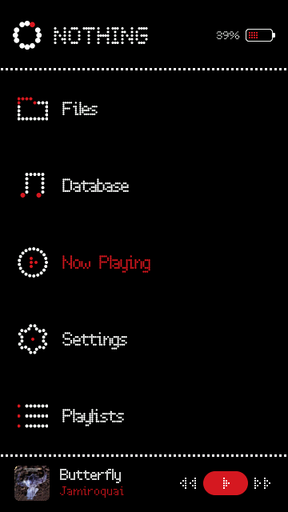
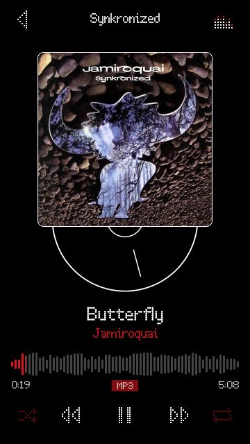
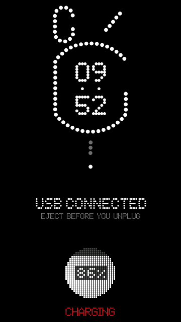

<div align="center">

# NDot Music

### A dot-matrix, heavily Nothing-inspired theme for **Rockbox** made exclusively for the **Hidizs AP80 Pro Max** DAP.

Pure black · round dots everywhere · one red accent · every screens are customized · 360 × 640 touchscreen

<br>

&nbsp;&nbsp;
&nbsp;&nbsp;


<sub>Main menu · Now Playing · USB charging — real 360 × 640 screenshots from the Rockbox simulator, playing Jamiroquai – <i>Butterfly</i></sub>

</div>

---

## What you get

**Now Playing**
- Square album art with a thin white frame and rounded corners, and a vinyl record peeking out underneath
- Centred title (white) and artist (red) in dot-matrix type, scrolling when too long
- A **waveform-style seek bar** — red for what has played, grey for the rest; tap or drag to seek
- Dotted transport controls: shuffle · previous · play/pause · next · repeat (red when engaged)
- File-type chip (MP3, FLAC…), elapsed / total time, album name in the header
- A tiny **dot-matrix equaliser** in the header that follows the music

**Main menu & lists**
- Big header: loader ring + **NOTHING** wordmark (the Ndot 55 look), battery with red dots that show the real charge, dotted separator (the same line sits above the mini-player footer)
- **33 hand-placed dotted icons** (white with a red accent each): Files, Database, Resume Playback, Settings gear, Playlists, Plugins, System and the whole Settings submenu
- **Back button** in the header of every menu (one level up); the footer mini player has a larger title and artist
- **Settings → Main Menu** (choose which items appear): each row shows its own item's icon (English and French UI)
- Other menus show their own title (“Playback”, “Theme Settings”…) in the header
- A **mini player footer** with rounded album art, title/artist and prev / play / next — tap the art to jump straight to Now Playing

**Track Info** (tap the album art on Now Playing)
- The stock two-lines-per-field list is replaced by a clean card: title, artist in red, album, big red dot-matrix duration, then rows with white labels and red values (genre, year, track, format, bitrate, sample rate)
- Tap the title bar (or press Back) to return

**USB / charging screen**
- The Nothing Phone (1) back-light pattern in round dots, with the time inside the ring as two rows of dot-matrix digits (hours above, minutes below)
- "USB CONNECTED" and a dim eject reminder, then a disc of 25 × 25 square dots that fills white from the bottom with the charge % written in its dots; the red state word (CHARGING / CHARGED) sits at the bottom of the screen
- Prefer the previous design (ring, bolt, charge figure, bar and readouts)? It is kept in [`extras/old-charging-screen`](extras/old-charging-screen) with install steps

## Install

> Tested on the Rockbox **simulator** built for the AP80 Pro Max (`hidizsap80max`). Please try it on a real device and open an issue if something looks off.

1. Download **`NDotMusic-AP80-Pro-Max-v1.0.0.zip`** from the [Releases](../../releases) page.
2. Unzip it and copy the `.rockbox` folder onto your player's storage — **merge** with the existing `.rockbox` (nothing is overwritten except this theme's own files).
3. On the player: **Settings → Theme Settings → Browse Theme Files** and pick **`NDotMusic.cfg`**.

Or from a clone of this repo: copy the `.rockbox/` folder in the repo root the same way.

### Touch
The theme cfg also sets `touchscreen mode: point`. The AP80 Pro Max defaults to *grid* mode (a 3 × 3 pad of buttons) in which you cannot tap menu rows directly; if taps do nothing, check that this setting is *Point*.

### Brightness
Applying the theme sets the backlight to **5 %** (`brightness: 5` in `.rockbox/themes/NDotMusic.cfg`). Change it in *Settings → Display → Brightness*, or delete that line from the cfg before applying the theme if you'd rather keep your own value.

### Tip: touch mode
The skin's touch areas (art → Now Playing, transport buttons…) need Rockbox's *Touchscreen mode* set to **Point** (the usual default on the AP80 Pro Max).

## Touch controls

| Where | Action |
|---|---|
| Now Playing – back arrow (top left) | Browse files |
| Now Playing – album art | Track Info card |
| Track Info – title bar | Back |
| Now Playing – seek bar | Seek |
| Now Playing – shuffle / repeat | Toggle shuffle / cycle repeat |
| Now Playing – prev / play / next | Previous · play-pause · next |
| Menus – footer art, title or artist | Go to Now Playing |
| Menus – footer prev / pill / next | Previous · play-pause · next |

Hardware buttons keep working as usual.

## Repository layout

```
.rockbox/
├── themes/NDotMusic.cfg           theme config  ← select this one
├── fonts/                         NDot-12 … NDot-57XL  (Rockbox .fnt)
└── wps/
    ├── NDotMusic.wps              Now Playing skin
    ├── NDotMusic.sbs              status bar, menus, lists, footer, USB screen
    └── NDotMusic/                 bitmaps (icons, waveform, vinyl, battery, ring…)
extras/old-charging-screen/        the previous USB / charging screen, kept as an optional swap-in (outside .rockbox)
previews/                          the screenshots above
```

## Credits & licences

- Theme skins, bitmaps and scripts: **MIT** (see [LICENSE](LICENSE)).
- **Not affiliated with Nothing Technology Limited.** This is a fan-made theme. “Nothing”, the Nothing wordmark and the *Ndot* typefaces are the property of Nothing Technology Ltd. (Ndot 55 / 57 were designed with Colophon Foundry).
- The `NDot-*.fnt` fonts and the *NOTHING* / *USB CONNECTED* title bitmaps are rasterised from Nothing's dot-matrix typefaces. They are included so the theme works, **for personal use only**, and are *not* covered by the MIT licence. If you are a rights holder and want them removed, open an issue.
- Built on [Rockbox](https://www.rockbox.org) (GPLv2) — thanks to everyone behind it and its skin engine.
- The previews show Jamiroquai – *Butterfly* (*Synkronized*, 1999); the cover art belongs to its owners and appears only in the screenshots, for illustration.
- Design inspiration: the Nothing Music app concept and the Nothing dot-matrix visual language.
