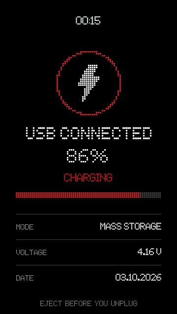

# The previous USB / charging screen

Before the Phone (1) light-pattern screen, the USB / charging screen was a big dotted ring with a bolt, a charge
figure, a progress bar and a few readouts. It is kept here, **outside `.rockbox`**, so it is never loaded by accident.

## Use it instead of the new one

The USB screen lives in the status-bar skin (`.sbs`), so swapping it means swapping that one skin and four bitmaps.
Copy the contents of [`wps/`](wps) over `.rockbox/wps/` on the player, **overwriting** the existing files:

| from this folder | to |
|---|---|
| `wps/NDotMusic.sbs` | `.rockbox/wps/NDotMusic.sbs` |
| `wps/NDotMusic/nd-usb-ring.bmp` | `.rockbox/wps/NDotMusic/nd-usb-ring.bmp` |
| `wps/NDotMusic/nd-usb-title.bmp` | `.rockbox/wps/NDotMusic/nd-usb-title.bmp` |
| `wps/NDotMusic/nd-usb-bar.bmp` | `.rockbox/wps/NDotMusic/nd-usb-bar.bmp` |
| `wps/NDotMusic/nd-usb-bar-track.bmp` | `.rockbox/wps/NDotMusic/nd-usb-bar-track.bmp` |

The other bitmaps of the new screen (`nd-usb-disc.bmp`, `nd-usb-pct.bmp`, `nd-usb-h1/h2/m1/m2.bmp`) can stay; the old skin
does not use them. Everything else in this skin file is identical to the current theme (main menu, lists, footer, Track
Info), so nothing else changes. To go back, copy the files from `.rockbox/wps/` of the main theme again.
